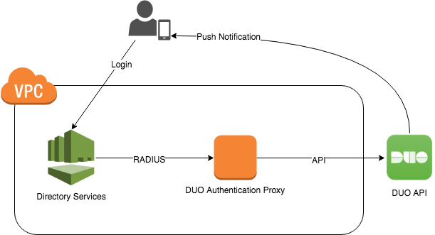

I recently had to add a second factor to an AWS Workspaces environment. We use [AWS Managed Microsoft AD](https://aws.amazon.com/directoryservice/) for the Workspaces directory, which can be configured to call an external RADIUS server for [secondary authentication](https://docs.aws.amazon.com/directoryservice/latest/admin-guide/ms_ad_mfa.html). Since we are already using DUO for other systems, I used the [Duo Authentication Proxy](https://duo.com/docs/authproxy_reference) to provide this second factor.

The proxy needs to be built from source. For example, on Ubuntu:


apt-get install build-essential libssl-dev python-dev libffi-dev
wget https://dl.duosecurity.com/duoauthproxy-latest-src.tgz
tar xzf duoauthproxy-latest-src.tgz
cd duoauthproxy-*-src
make
cd duoauthproxy-build
./install


Configuration of the DUO client is fairly straightforward. We just need to update `/opt/duoauthproxy/conf/authproxy.cfg` with our DUO API credentials, the IP addresses of the two domain controllers, and the RADIUS secret we want to use. Note that directory services only supports a single RADIUS secret used by all domain controllers, so just enter the same one twice. 


[duo_only_client]
; This section has no settings

[radius_server_auto]
client=duo_only_client
port=1812
ikey=<duo_integration_key>
skey=<duo_secret_key>
api_host=<duo_api_host>

radius_ip_1=<dc1_ip_address>
radius_secret_1=<radius_secret>
radius_ip_2=<dc2_ip_address>
radius_secret_2=<radius_secret>

failmode=secure
allow_concat=false
factors=push


Finally we can configure directory services to use the DUO proxy as a second factor. This is simplest in the console, but can also be done via the command line:


cat > settings.json <<EOF
{
    "RadiusServers": ["<dc1_ip_address>", "<dc2_ip_address>"],
    "RadiusPort": 1812,
    "RadiusTimeout": 30,
    "RadiusRetries": 4,
    "SharedSecret": "<radius_secret>",
    "AuthenticationProtocol": "PAP",
    "DisplayLabel": "DUO",
    "UseSameUsername": true
}
EOF

aws ds enable-radius --directory-id <directory-id> --cli-input-json file:///settings.json
